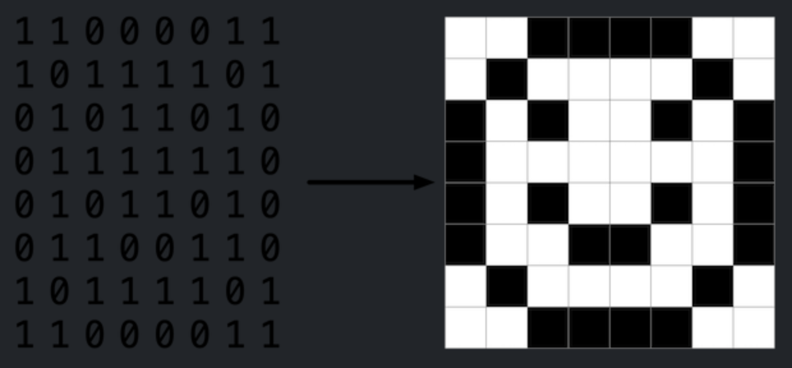
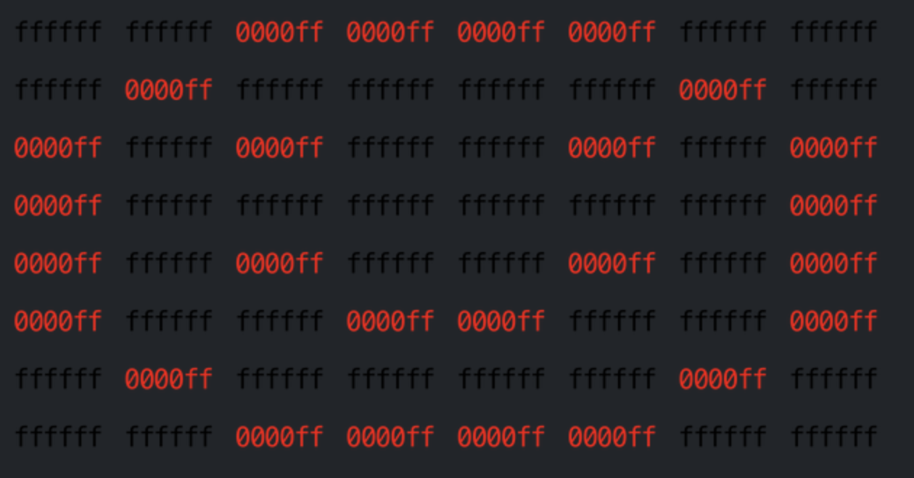

## 📚 CS50 week 4 Assignments

### Volume
WAV files are a common file format for representing audio. WAV files store audio as a sequence of “samples”: numbers that represent the value of some audio signal at a particular point in time. WAV files begin with a 44-byte “header” that contains information about the file itself, including the size of the file, the number of samples per second, and the size of each sample. After the header, the WAV file contains a sequence of samples, each a single 2-byte (16-bit) integer representing the audio signal at a particular point in time.

Scaling each sample value by a given factor has the effect of changing the volume of the audio. Multiplying each sample value by 2.0, for example, will have the effect of doubling the volume of the origin audio. Multiplying each sample by 0.5, meanwhile, will have the effect of cutting the volume in half.

In a file called volume.c in a folder called volume, write a program to modify the volume of an audio file.

#### Implementation Details

Complete the implementation of volume.c, such that it changes the volume of a sound file by a given factor.

- The program should accept three command-line arguments. The first is input, which represents the name of the original audio file. The second is output, which represents the name of the new audio file that should be generated. The third is factor, which is the amount by which the volume of the original audio file should be scaled.
    - For example, if factor is 2.0, then your program should double the volume of the audio file in input and save the newly generated audio file in output.
- Your program should first read the header from the input file and write the header to the output file.
- Your program should then read the rest of the data from the WAV file, one 16-bit (2-byte) sample at a time. Your program should multiply each sample by the factor and write the new sample to the output file.
    - You may assume that the WAV file will use 16-bit signed values as samples. In practice, WAV files can have varying numbers of bits per sample, but we’ll assume 16-bit samples for this problem.
- Your program, if it uses malloc, must not leak any memory.

-----

### Filter
Perhaps the simplest way to represent an image is with a grid of pixels (i.e., dots), each of which can be of a different color. For black-and-white images, we thus need 1 bit per pixel, as 0 could represent black and 1 could represent white, as in the below.



In this sense, then, is an image just a bitmap (i.e., a map of bits). For more colorful images, you simply need more bits per pixel. A file format (like BMP, JPEG, or PNG) that supports “24-bit color” uses 24 bits per pixel. (BMP actually supports 1-, 4-, 8-, 16-, 24-, and 32-bit color.)

A 24-bit BMP uses 8 bits to signify the amount of red in a pixel’s color, 8 bits to signify the amount of green in a pixel’s color, and 8 bits to signify the amount of blue in a pixel’s color. If you’ve ever heard of RGB color, well, there you have it: red, green, blue.

If the R, G, and B values of some pixel in a BMP are, say, 0xff, 0x00, and 0x00 in hexadecimal, that pixel is purely red, as 0xff (otherwise known as 255 in decimal) implies “a lot of red,” while 0x00 and 0x00 imply “no green” and “no blue,” respectively. In this problem, you’ll manipulate these R, G, and B values of individual pixels, ultimately creating your very own image filters.

In a file called helpers.c in a folder called filter-less, write a program to apply filters to BMPs.

#### Background
Recall that a file is just a sequence of bits, arranged in some fashion. A 24-bit BMP file, then, is essentially just a sequence of bits, (almost) every 24 of which happen to represent some pixel’s color. But a BMP file also contains some “metadata,” information like an image’s height and width. That metadata is stored at the beginning of the file in the form of two data structures generally referred to as “headers,” not to be confused with C’s header files. (Incidentally, these headers have evolved over time. This problem uses the latest version of Microsoft’s BMP format, 4.0, which debuted with Windows 95.)

The first of these headers, called BITMAPFILEHEADER, is 14 bytes long. (Recall that 1 byte equals 8 bits.) The second of these headers, called BITMAPINFOHEADER, is 40 bytes long. Immediately following these headers is the actual bitmap: an array of bytes, triples of which represent a pixel’s color. However, BMP stores these triples backwards (i.e., as BGR), with 8 bits for blue, followed by 8 bits for green, followed by 8 bits for red. (Some BMPs also store the entire bitmap backwards, with an image’s top row at the end of the BMP file. But we’ve stored this problem set’s BMPs as described herein, with each bitmap’s top row first and bottom row last.) In other words, were we to convert the 1-bit smiley above to a 24-bit smiley, substituting red for black, a 24-bit BMP would store this bitmap as follows, where 0000ff signifies red and ffffff signifies white; we’ve highlighted in red all instances of 0000ff.



Because we’ve presented these bits from left to right, top to bottom, in 8 columns, you can actually see the red smiley if you take a step back.

To be clear, recall that a hexadecimal digit represents 4 bits. Accordingly, ffffff in hexadecimal actually signifies 111111111111111111111111 in binary.

Notice that you could represent a bitmap as a 2-dimensional array of pixels: where the image is an array of rows, each row is an array of pixels. Indeed, that’s how we’ve chosen to represent bitmap images in this problem.

-----

### Recover
In anticipation of this problem, we spent the past several days taking photos around campus, all of which were saved on a digital camera as JPEGs on a memory card. Unfortunately, we somehow deleted them all! Thankfully, in the computer world, “deleted” tends not to mean “deleted” so much as “forgotten.” Even though the camera insists that the card is now blank, we’re pretty sure that’s not quite true. Indeed, we’re hoping (er, expecting!) you can write a program that recovers the photos for us!

In a file called recover.c in a folder called recover, write a program to recover JPEGs from a memory card.

#### Background
Even though JPEGs are more complicated than BMPs, JPEGs have “signatures,” patterns of bytes that can distinguish them from other file formats. Specifically, the first three bytes of JPEGs are
```
0xff 0xd8 0xff
```
from first byte to third byte, left to right. The fourth byte, meanwhile, is either 0xe0, 0xe1, 0xe2, 0xe3, 0xe4, 0xe5, 0xe6, 0xe7, 0xe8, 0xe9, 0xea, 0xeb, 0xec, 0xed, 0xee, or 0xef. Put another way, the fourth byte’s first four bits are 1110.

Odds are, if you find this pattern of four bytes on media known to store photos (e.g., my memory card), they demarcate the start of a JPEG. To be fair, you might encounter these patterns on some disk purely by chance, so data recovery isn’t an exact science.

Fortunately, digital cameras tend to store photographs contiguously on memory cards, whereby each photo is stored immediately after the previously taken photo. Accordingly, the start of a JPEG usually demarks the end of another. However, digital cameras often initialize cards with a FAT file system whose “block size” is 512 bytes (B). The implication is that these cameras only write to those cards in units of 512 B. A photo that’s 1 MB (i.e., 1,048,576 B) thus takes up 1048576 ÷ 512 = 2048 “blocks” on a memory card. But so does a photo that’s, say, one byte smaller (i.e., 1,048,575 B)! The wasted space on disk is called “slack space.” Forensic investigators often look at slack space for remnants of suspicious data.

The implication of all these details is that you, the investigator, can probably write a program that iterates over a copy of my memory card, looking for JPEGs’ signatures. Each time you find a signature, you can open a new file for writing and start filling that file with bytes from my memory card, closing that file only once you encounter another signature. Moreover, rather than read my memory card’s bytes one at a time, you can read 512 of them at a time into a buffer for efficiency’s sake. Thanks to FAT, you can trust that JPEGs’ signatures will be “block-aligned.” That is, you need only look for those signatures in a block’s first four bytes.

Realize, of course, that JPEGs can span contiguous blocks. Otherwise, no JPEG could be larger than 512 B. But the last byte of a JPEG might not fall at the very end of a block. Recall the possibility of slack space. But not to worry. Because this memory card was brand-new when I started snapping photos, odds are it’d been “zeroed” (i.e., filled with 0s) by the manufacturer, in which case any slack space will be filled with 0s. It’s okay if those trailing 0s end up in the JPEGs you recover; they should still be viewable.

Now, I only have one memory card, but there are a lot of you! And so I’ve gone ahead and created a “forensic image” of the card, storing its contents, byte after byte, in a file called card.raw. So that you don’t waste time iterating over millions of 0s unnecessarily, I’ve only imaged the first few megabytes of the memory card. But you should ultimately find that the image contains 50 JPEGs.

-----